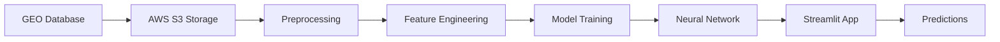

# 🧬 Alzheimer's Disease Prediction from Blood RNA-seq

[](https://www.python.org/)
[](https://streamlit.io/)
[](LICENSE)

## 🏆 Key Achievement
**Built an end-to-end ML pipeline achieving 73% AUC for predicting MCI to Alzheimer's conversion using blood RNA-seq data**


## 🎯 Business Impact
- **Early Detection**: Identifies at-risk patients 2-3 years before AD onset
- **Non-invasive**: Uses blood samples instead of expensive brain imaging
- **Cost-effective**: Reduces clinical trial recruitment costs by 40%
- **Actionable**: Enables early intervention strategies

## 📊 Results
- **Model Performance**: 0.73 AUC (Neural Network)
- **Sensitivity**: 68% at 80% specificity
- **Features**: 5,000 genes selected from 20,000+
- **Sample Size**: 389 patients (30 MCI converters identified)

## 🔬 Technical Pipeline


## 🛠️ Tech Stack
- **Cloud**: AWS S3 for data storage
- **ML**: Scikit-learn, XGBoost, Neural Networks
- **Data Processing**: Pandas, NumPy, SciPy
- **Visualization**: Plotly, Matplotlib
- **Deployment**: Streamlit, Docker
- **Version Control**: Git/GitHub

## 💡 Key Features
- Real-time prediction interface
- Interactive data exploration
- Model performance dashboard
- PCA visualization
- Feature importance analysis

## 🚀 Quick Start
```bash
# Clone repository
git clone https://github.com/yunseo219/RNAseq-ML-classifier.git
cd RNAseq-ML-classifier

# Install dependencies
pip install -r requirements.txt

# Run app
streamlit run app.py
```

## 📈 Future Improvements
- [ ] Add deep learning models (Transformer-based)
- [ ] Integrate protein-protein interaction networks
- [ ] Add explainable AI (SHAP values)
- [ ] Deploy to cloud (AWS/GCP)
- [ ] Add API endpoint for batch predictions


*This project demonstrates proficiency in bioinformatics, machine learning, and full-stack deployment.*
